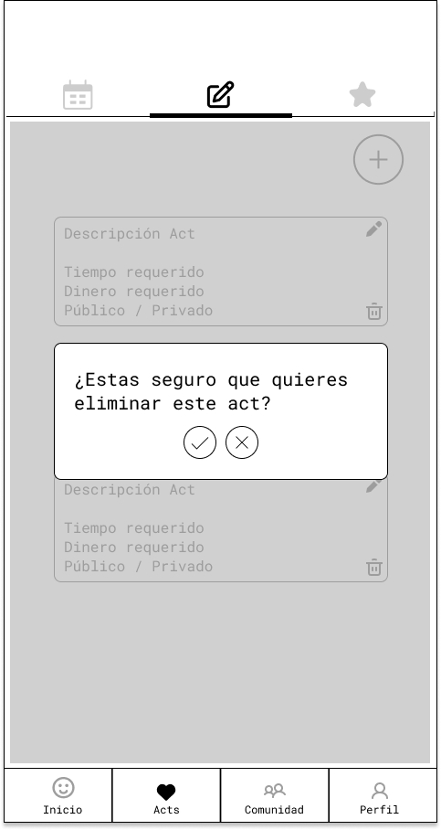
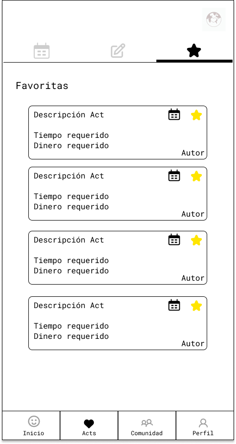
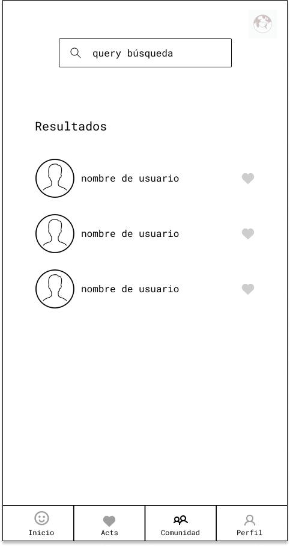

# bHooman

## Intro
----

bHooman es una aplicación que busca crear una comunidad para compartir, crear e incentivar las buenas acciones que podemos hacer cada día por otros y por el planeta, de forma desinteresada y recordándonos ser más humanos cada día. 

## Functional Description
---
- Ver la lista completa de acciones
- Filtrar buenas acciones, según descripción, tiempo requerido, dinero requerido.
- Añadir buenas acciones a su lista de favoritas
- Elminar buenas acciones de su lista de favoritas
- Crear buenas acciones propias, configurarlas para que sean privadas o públicas para incluirlas en la lista pública disponible
- Modificar las buenas acciones que ha creado
- Eliminar las buenas acciones que ha creado
- Agendar las buenas acciones de cada día
- Modificar las agendas que ha programado
- Eliminar las agendas que ha programado
- Configurar las notificaciones a recibir
- Agregar otros usuarios a su lista de seguidos
- Buscar usuarios por nombre de perfil
- Ver la lista de usuarios seguidos
- Ver el perfil otros usuarios
- Eliminar usuarios de su lista de seguidos

### Use Cases

### Flow Charts

#### Schedule Act

#### Create Act

#### Add Favorite

### User Interface (UI)
___

#### Landing

#### Register

#### Home

##### Home - Schedule

#### My Acts 
##### My Acts - scheduled

##### My Acts - creations

###### My Acts - creations - create

###### My Acts - creations - edit

###### My Acts - creations - delete

##### My Acts - favorites

#### Community

##### Community - Search

##### Community - Other User Profile

#### Profile

##### Profile- Update Profile

##### Profile- Update Password

##### Profile- Delete Account

##### Profile- Activity

## Technical Description
---

### Blocks

### Data Model

#### Schemas

user
- username (String, required, unique)
- email (String, required, unique)
- password (String, required)
- favs ([ObjectId: Action])
- notifications (Boolean, required, default: false)
- following ([ObjectId: User])
- follower ([ObjectId: User])

actions
- description (String, required)
- public (Boolean, required, default: false)
- requiredTime (Number, required)
- requiredBudget ( Number, required)
- author (ObjectId: User, required)

schedules
- user (ObjectId: User, required)
- action (ObjectId: Action, required)
- date (Date, required)
- repeat (String ['once', 'daily', 'weekly', 'biweekly', 'monthly', 'none'], default: 'once', required)
- completed ([Date])

### Technologies
- Javascript
- React
- CSS
- Sass
- HTML
- Express
- Mongo
- Node

------------------------------------

# TASK LIST

## Docs
- ~~DONE introduce the project, describe it (.5h)~~

### Functional Description
- ~~DONE create use cases diagram (.25h)~~ 
- ~~DONE create wireframes in figma (alt excalidraw) (3h)~~
- ~~DONE create wireframes in README (images) (1h)~~

### Techincal Description
- ~~DONE create blocks diagram (.5h)~~
- ~~DONE create data model in paper (1h)~~
- ~~DONE create data model in diagrams.net (E/R) (1h)~~
- ~~DONE create data model in README (images) (1h)~~

## Server

### Data
- ~~DONE create mongoose schemas and models (2h)~~
- ~~DONE create populate.js to test my models (1h)~~
- ~~DONE populate database with actions~~

### Logic
- ~~DONE create logic methods (20h)~~
- ~~DONE test logic methods in demo.js (4h)~~

### API
- ~~DONE create .env (0.1h)~~
- ~~DONE create helpers (1h)~~
- ~~DONE create index.js (1h)~~
- ~~DONE create handlers(2h)~~
- ~~DONE test with Insomnia (1h)~~

## Client

### App Logic
- ~~DONE create App logics (3h)~~
- ~~DONE test with snippets(2h)~~

### App
- ~~DONE  create main views (components) (1h)~~
- ~~DONE mechanize navigations (.5h)~~

# TASK LIST
- Testing
- Feedback
- Manejo de errores
- Calendario
- Notificaciones Push
- Vista Actividad Usuario (gráficos)
- Validación repeticiones al crear acciones públicas